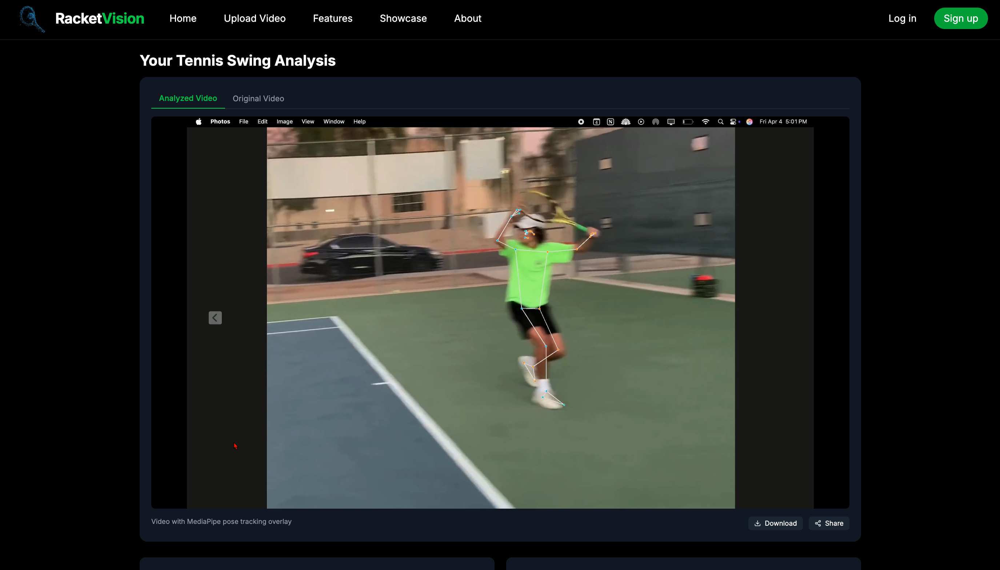

# RacketVision

A modern AI-powered tennis coaching platform that analyzes your tennis shots to improve technique.

## About The Project

RacketVision uses computer vision and AI to analyze tennis forehand technique from uploaded videos. The system identifies key body positions during your swing and provides actionable feedback to help improve your form.

## Tech Stack

- **Frontend**: Next.js with Tailwind CSS for a modern, responsive interface
- **Backend**: Python FastAPI for efficient video processing
- **AI Engine**: MediaPipe for pose estimation and landmark detection
- **Database**: Supabase for user data and video storage

## Features

- Upload tennis videos for AI analysis
- Automated pose tracking with visual feedback
- Compare your form with professional techniques
- Receive specific coaching tips to improve your swing
- Download analyzed videos with visual overlays

## Project Status

This project is currently in early development. The repository showcases the concept while the full implementation is being actively developed.

## Screenshots

## Contact

For questions or collaboration inquiries, please contact:
- Email: your-email@example.com

---

© 2025 RacketVision. All Rights Reserved.
